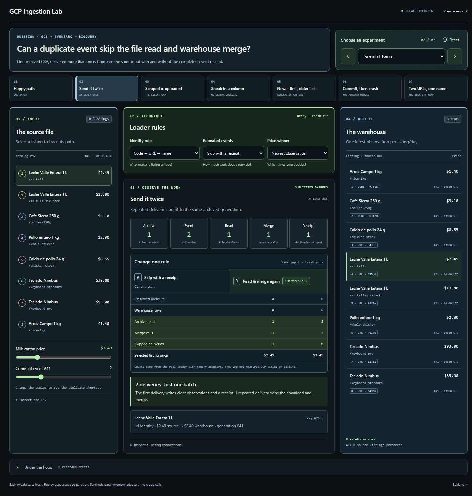
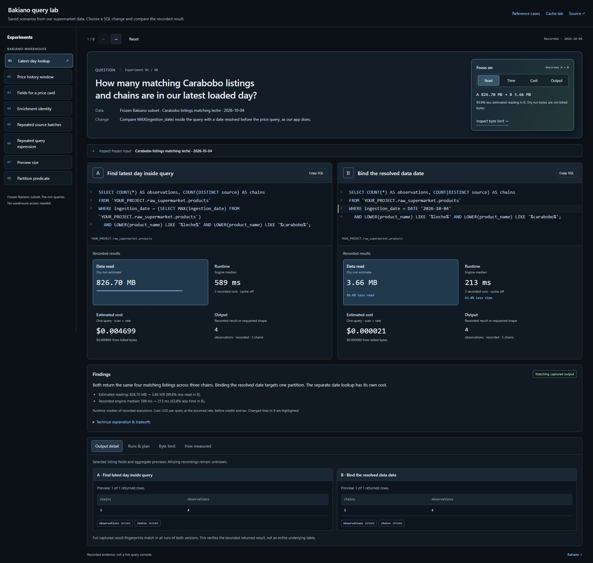
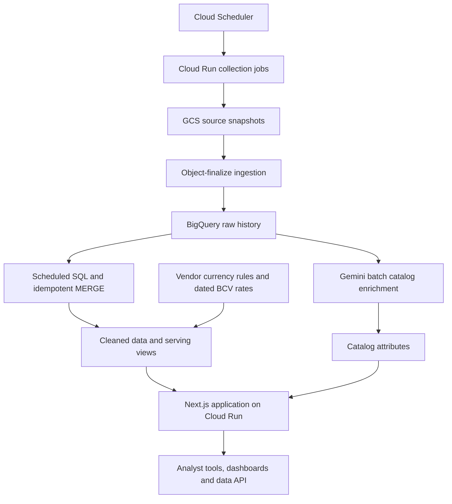

# Bakiano

Market intelligence for Venezuela: explore published prices, compare listings, and follow changes across supermarkets, retail, and real estate.

**[Explore Bakiano](https://bakiano.com/en)** · **[Data and API](https://bakiano.com/en/datos)** · **[About the builder](https://me.alejandrofranks.workers.dev)**

Public engineering case study by Alejandro Frank. The product source is private. The three repositories below make individual engineering boundaries runnable and inspectable.

**[Runnable labs](#three-engineering-questions) · [GCP architecture](#architecture) · [Engineering decisions](#decisions-that-matter) · [Product views](#product-views)**

## Three engineering questions

| Start with a question | Open the lab | What changes |
| --- | --- | --- |
| Can a duplicate file event avoid another download and merge? | [GCP Ingestion Lab](https://github.com/alejandrofrank/gcp-ingestion-lab) | Compare receipts, identity rules and observation timestamps through actual loader executions. |
| Can the same answer read far less warehouse data? | [BigQuery Query Guard](https://github.com/alejandrofrank/bigquery-query-guard) | Inspect SQL first, then recorded bytes, time, cost and output from a frozen Bakiano subset. |
| Do different product names describe the same presentation? | [Catalog Match Lab](https://github.com/alejandrofrank/catalog-match-lab) | Edit a name and inspect brand, variant, size, unit and pack checks beside keyword overlap. |

All three local demos require Node.js 22+ and run without credentials. Default browser interactions make no cloud or model calls.

<strong>Ingestion:</strong> eight rows with either receipt rule, but one read and merge versus two

Change the delivery count, apply the opposite rule, and inspect the event journal. Identity migration exposes six collapsed rows, fourteen rows after replay, and eight after explicit repair.

Data: synthetic listings. Execution: real loader core with memory adapters. Counts are adapter operations, not GCP timing or billing.

[Run the lab](https://github.com/alejandrofrank/gcp-ingestion-lab#run-it-in-15-seconds) · [Core loader](https://github.com/alejandrofrank/gcp-ingestion-lab/blob/main/src/engine.js) · [GCP batch adapter](https://github.com/alejandrofrank/gcp-ingestion-lab/blob/main/src/gcp.js)

<strong>BigQuery:</strong> query-first A/B blocks, recorded measurements, then findings

The latest-day case returns four matching listings across three chains. Resolving the date first changes the recorded dry-run estimate from 826.70 MB to 3.66 MB. Eight Bakiano scenarios cover date resolution, history, columns, enrichment joins, repeated batches, nested scalar queries, preview limits and partition predicates.

Data: a reviewed frozen subset of real Bakiano observations. Execution: bundled pre-run evidence. Prices are as scraped; packages differ. Runtime samples are observations, not universal speed guarantees. A separate guard sandbox demonstrates authorization, cache scopes and byte caps with simulated adapters.

[Run the lab](https://github.com/alejandrofrank/bigquery-query-guard#try-it-without-gcp) · [Query boundary](https://github.com/alejandrofrank/bigquery-query-guard/blob/main/src/index.js) · [Recording and limits](https://github.com/alejandrofrank/bigquery-query-guard/blob/main/docs/market-lab.md)

<strong>Catalog:</strong> a shared brand word still cannot make 200 ml equal 1 L

Switch between size, variant, pack and missing-detail boundaries. The chicken example also demonstrates an alias match without shared keywords. Only accepted presentations enter the comparable-price range.

Data: fictional brands, merchants and prices. Execution: a small explicit dictionary and identity rules. Unknown attributes require review. Jev is an optional explicit provider request; offline rules are not labeled as model results.

[Run the lab](https://github.com/alejandrofrank/catalog-match-lab#try-it) · [Identity checks](https://github.com/alejandrofrank/catalog-match-lab/blob/main/src/match.js) · [Fixture evaluations](https://github.com/alejandrofrank/catalog-match-lab/blob/main/eval/run.js)

## The problem

Venezuelan market information is spread across retailer sites and property platforms. Listings change, product descriptions vary, and currency conversion complicates comparisons. A useful research tool needs dated observations, consistent attributes, and a way to inspect the source behind a result.

Bakiano brings those observations into one workspace for research, comparisons, and watchlists. Its AI analyst works through a defined set of data tools.

## What I built

My work spans the collection infrastructure, historical warehouse, transformations and enrichment, and the application that makes the data usable.

- **Collection and history:** scheduled collectors, archived source snapshots, and records of collection health.
- **Comparable data:** cleaned listings, catalog attributes, and currency-aware serving views.
- **Product:** a Next.js application with an analyst, dashboards, and listing follow-up workflows.
- **Operations:** infrastructure as code, container deployments, bounded warehouse queries, and a shared result cache.

## Architecture

Terraform defines the infrastructure. GitHub Actions builds changed container images and applies infrastructure changes after merge. Some collectors use scheduled Tailscale gateway VMs for Venezuelan network access.

| Need | GCP component | What it does |
| --- | --- | --- |
| Run collection on a schedule | Cloud Scheduler + Cloud Run jobs | Start vendor collectors without a continuously running application worker |
| Keep replayable source files | Cloud Storage | Archive snapshots by domain, vendor and date before warehouse loading |
| Turn published files into observations | Object-finalize ingestion + BigQuery | Validate the collected file and load the historical layer |
| Produce serving data | BigQuery scheduled SQL, MERGE and views | Revisit recent dates, clean attributes and apply dated currency rules |
| Classify catalog attributes | Gemini on Vertex AI + separate BigQuery tables | Store enrichment independently of changing price observations |
| Serve the product | Cloud Run + Next.js | Expose analyst tools, comparisons and dated observations |

The labs isolate these concerns; they are not copies of the entire deployed platform. In particular, the ingestion lab includes its own optional Eventarc/Cloud Run setup, while the diagram above describes Bakiano's existing object-finalize pipeline.

## Decisions that matter

### Preserve source observations

CSV snapshots are archived by domain, vendor, and date before loading into BigQuery. This preserves a source for reprocessing and backfills when parsing or transformation logic changes. Raw records retain the collected values.

### Recover recent missed runs

Scheduled transformations revisit a rolling three-day window using idempotent `MERGE` operations. This allows recent missed runs to be picked up on a later execution without blindly duplicating processed records. Recovery outside that window requires an explicit backfill.

### Keep prices separate from enrichment

AI enrichment classifies product type, brand, units, weight, and related attributes. Those results are stored separately from prices. Serving joins use the latest raw partition so an older classification result does not freeze an older price into the catalog.

### Make currency conversion traceable

Raw prices remain unchanged. Serving views derive USD values using vendor currency rules and the BCV rate associated with the ingestion date. A USD change can therefore reflect both a published-price change and an exchange-rate movement.

### Bound the analyst's access and cost

The analyst uses defined tools instead of unrestricted SQL. Metered, byte-capped queries and a shared result cache control warehouse usage. Collection health is recorded alongside the data pipeline.

## Technology

Python · Scrapy / nodriver · Cloud Run · Cloud Scheduler · Google Cloud Storage · BigQuery · Gemini on Vertex AI · Next.js · Terraform · Docker · GitHub Actions

## Product views

The public website connects a result to its retailer, observation dates and original listing. These captured product views are dated snapshots, not current quotations.

Public homepage

A dated price observation and its source

Pack size, availability and exchange rates can affect interpretation.

## Scope and access

The public website includes observed-price samples and product information. The analyst and application require sign-in. Some landing-page workflow examples use explicitly labeled fictional data; they are illustrations, not reported results.

Coverage and history vary by source. Published prices are not completed sales, and similar listing names do not establish that two products or properties are equivalent.

This repository contains documentation and public screenshots. The platform overview is based on the technical walkthrough published on [my portfolio](https://me.alejandrofranks.workers.dev); each linked lab documents its own implementation and verification boundary.
