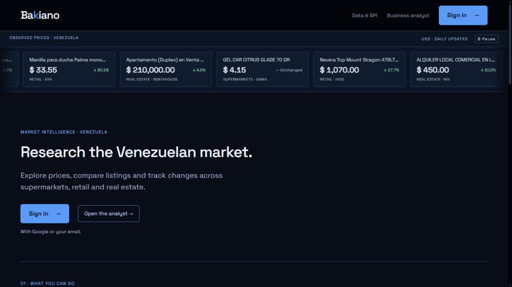
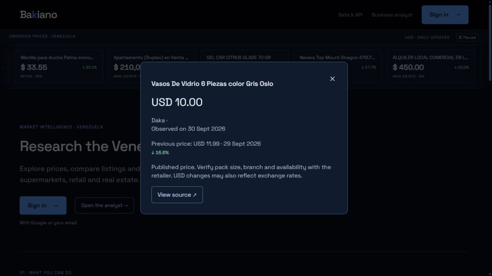
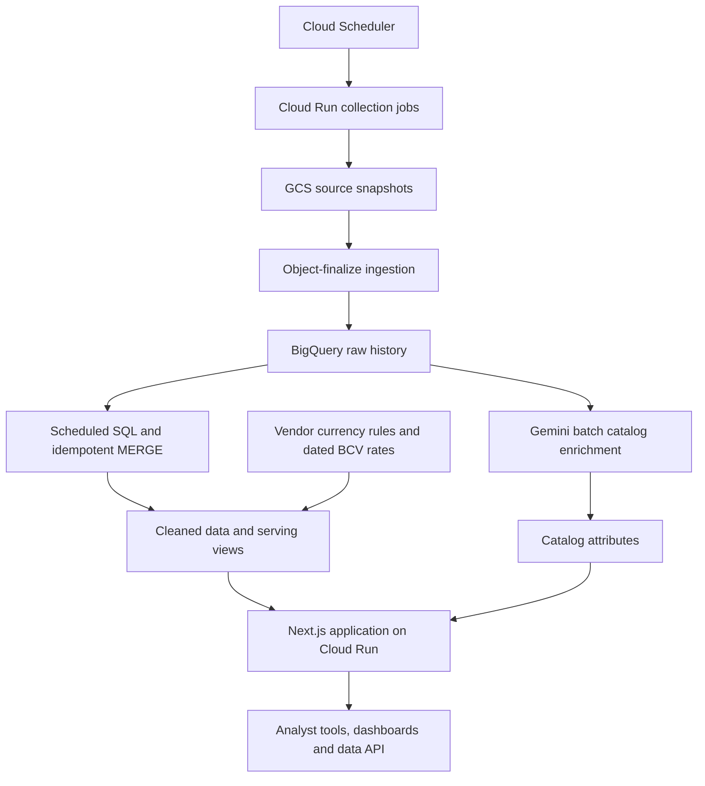

# Bakiano

**Market intelligence for Venezuela: explore published prices, compare listings, and follow changes across supermarkets, retail, and real estate.**

**[Explore Bakiano](https://bakiano.com/en)** · **[Data and API](https://bakiano.com/en/datos)** · **[About the builder](https://me.alejandrofranks.workers.dev)**

*Public engineering case study by Alejandro Frank. The product source code is private. Screenshots capture the public product; observed prices are dated snapshots, not current quotations.*

## The problem

Venezuelan market information is spread across retailer sites and property platforms. Listings change, product descriptions vary, and currency conversion complicates comparisons. A useful research tool needs dated observations, consistent attributes, and a way to inspect the source behind a result.

Bakiano brings those observations into one workspace for research, comparisons, and watchlists. Its AI analyst works through a defined set of data tools.

## What I built

My work spans the collection infrastructure, historical warehouse, transformations and enrichment, and the application that makes the data usable.

- **Collection and history:** scheduled collectors, archived source snapshots, and records of collection health.
- **Comparable data:** cleaned listings, catalog attributes, and currency-aware serving views.
- **Product:** a Next.js application with an analyst, dashboards, and listing follow-up workflows.
- **Operations:** infrastructure as code, container deployments, bounded warehouse queries, and a shared result cache.

## A real observation

This public detail view connects a price change to its retailer, observation dates, and original listing. It also makes the comparison's limits visible: pack size, availability, and exchange rates can affect interpretation.

## Architecture

Terraform defines the infrastructure. GitHub Actions builds changed container images and applies infrastructure changes after merge. Some collectors use scheduled Tailscale gateway VMs for Venezuelan network access.

## Decisions that matter

### Preserve source observations

CSV snapshots are archived by domain, vendor, and date before loading into BigQuery. This preserves a source for reprocessing and backfills when parsing or transformation logic changes. Raw records retain the collected values.

### Recover recent missed runs

Scheduled transformations revisit a rolling three-day window using idempotent `MERGE` operations. This allows recent missed runs to be picked up on a later execution without blindly duplicating processed records. Recovery outside that window requires an explicit backfill.

### Keep prices separate from enrichment

AI enrichment classifies product type, brand, units, weight, and related attributes. Those results are stored separately from prices. Serving joins use the latest raw partition so an older classification result does not freeze an older price into the catalog.

### Make currency conversion traceable

Raw prices remain unchanged. Serving views derive USD values using vendor currency rules and the BCV rate associated with the ingestion date. A USD change can therefore reflect both a published-price change and an exchange-rate movement.

### Bound the analyst's access and cost

The analyst uses defined tools instead of unrestricted SQL. Metered, byte-capped queries and a shared result cache control warehouse usage. Collection health is recorded alongside the data pipeline.

## Technology

Python · Scrapy / nodriver · Cloud Run · Cloud Scheduler · Google Cloud Storage · BigQuery · Gemini on Vertex AI · Next.js · Terraform · Docker · GitHub Actions

## Scope and access

The public website includes observed-price samples and product information. The analyst and application require sign-in. Some landing-page workflow examples use explicitly labeled fictional data; they are illustrations, not reported results.

Coverage and history vary by source. Published prices are not completed sales, and similar listing names do not establish that two products or properties are equivalent.

This repository contains documentation and public screenshots. The implementation overview is based on the technical walkthrough published on [my portfolio](https://me.alejandrofranks.workers.dev).
